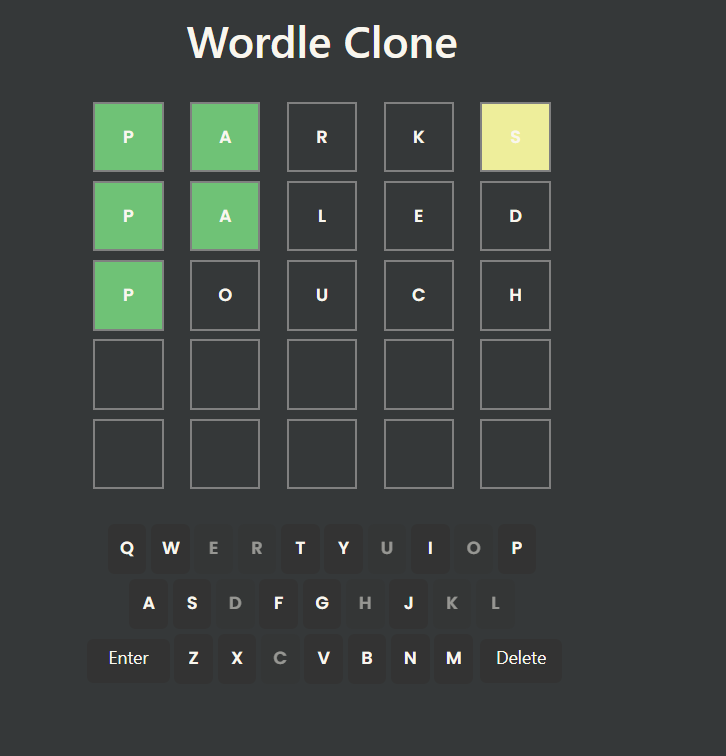
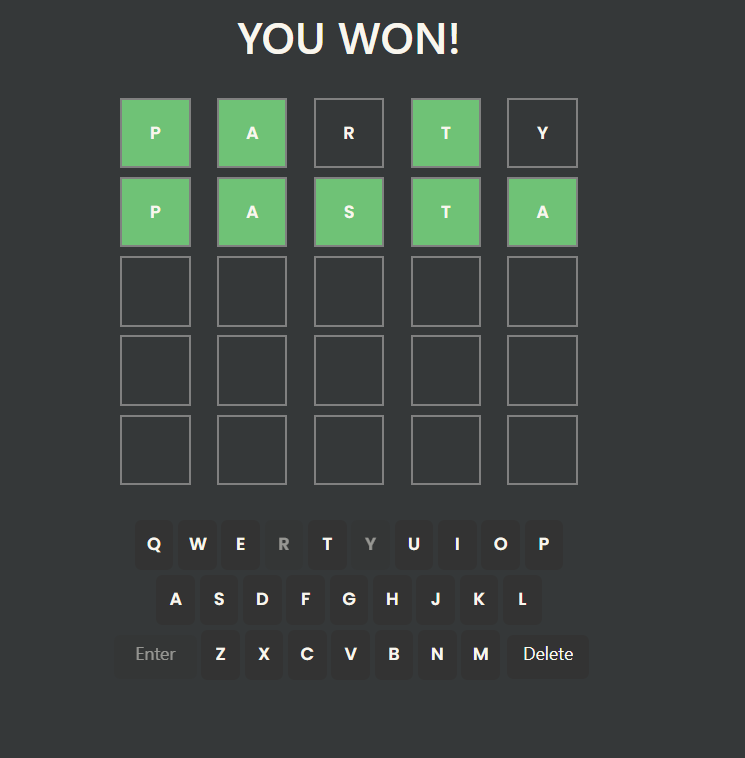
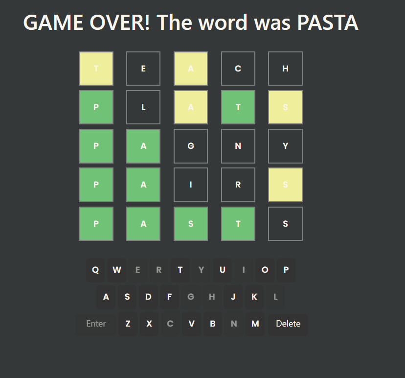

# Wordle Clone

A fully functional browser-based clone of the popular word game Wordle, built with vanilla JavaScript.

## 🎮 Demo

[Live Demo](#) <!-- TODO: Add your GitHub Pages link here after deployment -->

## 📸 Screenshots
   ### Gameplay
   
   
   ### Win State
   
   
   ### Loss State
   

<!-- TODO: Add screenshots of your game here -->
<!-- Suggested screenshots: -->
<!-- - Game in progress -->
<!-- - Win state -->
<!-- - Loss state -->

## 🚀 Features

- **Interactive Keyboard**: Click letters to build your guess
- **Smart Color Feedback**: 
  - 🟩 Green for correct letters in the correct position
  - 🟨 Yellow for correct letters in the wrong position
  - ⬜ Gray for letters not in the word
- **Duplicate Letter Handling**: Properly handles words with repeated letters (e.g., "PASTA")
- **Keyboard State Management**: Disables keys for letters not in the word
- **Win/Loss Detection**: 6 attempts to guess the word
- **Delete Functionality**: Backspace to correct mistakes

## 🛠️ Technologies Used

- HTML5
- CSS3
- Vanilla JavaScript (ES6)

## 💡 What I Learned

Building this project taught me several important concepts:

1. **Complex State Management**: Managing multiple game states (current row, box position, letter tracking) without a framework
2. **Algorithm Design**: Implementing the duplicate letter logic was particularly challenging - I used a Map data structure to track letter availability and ensure proper color feedback
3. **DOM Manipulation**: Dynamically updating UI elements based on user interaction
4. **Event Handling**: Managing keyboard clicks, delete, and enter button interactions
5. **Game Logic**: Translating game rules into code with win/loss conditions

### The Duplicate Letter Challenge

The trickiest part was handling words with duplicate letters correctly. For example, if the word is "PASTA" and the user guesses "LLAMA":
- The first 'A' should be yellow (correct letter, wrong position)
- The second 'A' should be green (correct letter, correct position)
- The third 'A' should be gray (no more 'A's available)

I solved this by:
1. Creating a Map to count available letters in the target word
2. First pass: Mark exact matches (green) and decrement the letter count
3. Second pass: Mark wrong-position matches (yellow) only if letters are still available

## 🎯 How to Play

1. Click letters on the on-screen keyboard to spell a 5-letter word
2. Click the delete button to remove the last letter
3. Click enter to submit your guess
4. You have 6 attempts to guess the correct word
5. Use the color feedback to guide your next guess

## 📦 Installation & Setup

1. Clone this repository:
   ```bash
   git clone https://github.com/YOUR_USERNAME/wordle-clone.git
   ```

2. Navigate to the project directory:
   ```bash
   cd wordle-clone
   ```

3. Open `index.html` in your browser:
   ```bash
   # On macOS
   open index.html
   
   # On Windows
   start index.html
   
   # On Linux
   xdg-open index.html
   ```

## 🎨 Project Structure

```
wordle-clone/
│
├── index.html          # Main HTML structure
├── style.css           # Game styling
├── script.js           # Game logic
└── README.md          # Project documentation
```

## 🔮 Future Enhancements

Potential features I'd like to add:

- [ ] Random word selection from a word list
- [ ] Physical keyboard support (not just on-screen clicks)
- [ ] Word validation against a dictionary
- [ ] Animations for tile flips and reveals
- [ ] Share results functionality
- [ ] Statistics tracking (games played, win rate)
- [ ] Dark mode
- [ ] Mobile responsive design improvements

## 🤝 Contributing

This is a personal learning project, but feedback and suggestions are welcome! Feel free to open an issue or submit a pull request.

## 📝 License

This project is open source and available under the [MIT License](LICENSE).

## 🙏 Acknowledgments

- Inspired by the original [Wordle](https://www.nytimes.com/games/wordle/index.html) by Josh Wardle
- Built as a learning project to practice vanilla JavaScript

---

**Note**: This is a clone built for educational purposes. The original Wordle was created by Josh Wardle and is now owned by The New York Times.
